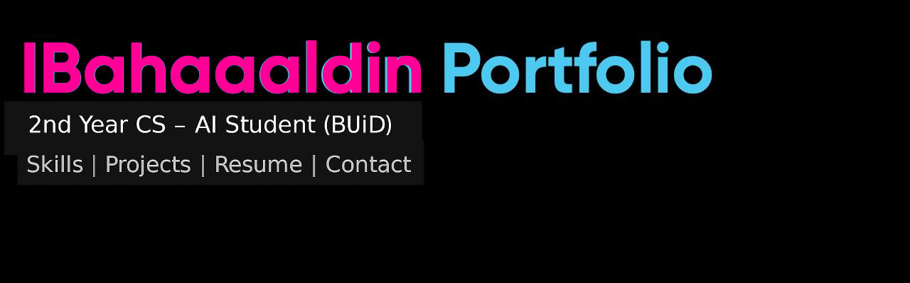
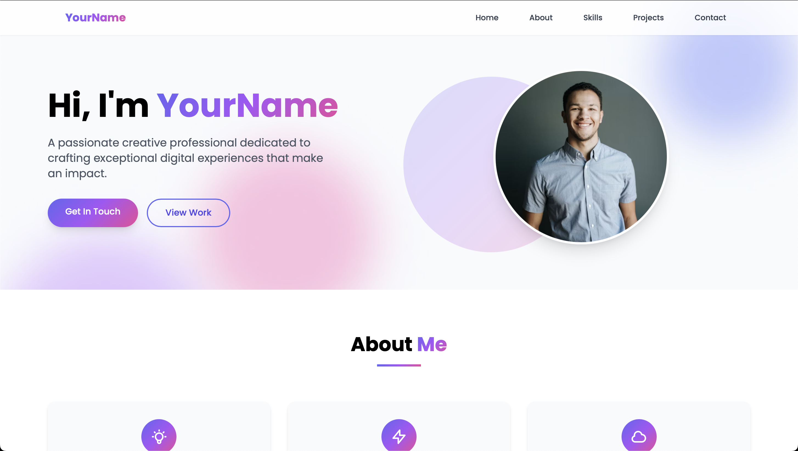

# 📁 Free Portfolio Website




---

## 👨‍💻 About the Developer

**IBahaaaldin** is a Computer Science – AI student at the British University in Dubai. With strong interests in AI, system design, and productivity tools, he builds software projects using Python, Java, HTML, and JavaScript, focusing on real-world usability and clean UI/UX.

---

## 📌 About This Project

This is a clean, responsive portfolio website built from scratch using **HTML**, **CSS**, and **JavaScript**. Designed to be professional, fast, mobile-friendly, and **ATS-aware**, this portfolio showcases key projects, skills, and contact links for recruiters, hiring managers, and collaborators.

> Created by IBahaaaldin, a second-year Computer Science – AI student at the British University in Dubai.

---

## ✨ Features

- Responsive layout (desktop, tablet, mobile)
- GitHub Projects integration 
- Contact form
- Accessible, SEO-friendly structure

---

## 🛠️ Tech Stack

- HTML5
- CSS3 (custom + variables)
- JavaScript (vanilla)

---

## 📷 Screenshots



---

## 📁 Project Structure

```
Portfolio/
├── docs/
│   └── assets/
│       ├── Portfolio_banner.jpg
│       └── Website_preview.jpg
│
├── index.html
├── LICENSE
└── README.md
```

---

## 🛠 Projects Highlighted

- ✅ [To-Do App (Java)](https://github.com/IBahaaaldin/To-Do-App-java)
- ✅ [To-Do App (Python)](https://github.com/IBahaaaldin/To-Do-App-python)
- ✅ [GPA Calculator (Python)](https://github.com/IBahaaaldin/GPA-Calculator-python)

Each includes:
- Project summary
- Screenshot preview
- GitHub repository links

---

## 📬 Contact

- **Email**: bahaam.coding@gmail.com  
- **LinkedIn**: [linkedin.com/in/bahaa-mohammed-371259369](https://www.linkedin.com/in/bahaa-mohammed-371259369)  
- **Instagram**: [@ibahaaaldin](https://www.instagram.com/ibahaaaldin)

---

## 📄 License

This project is licensed under the [MIT License](LICENSE).
